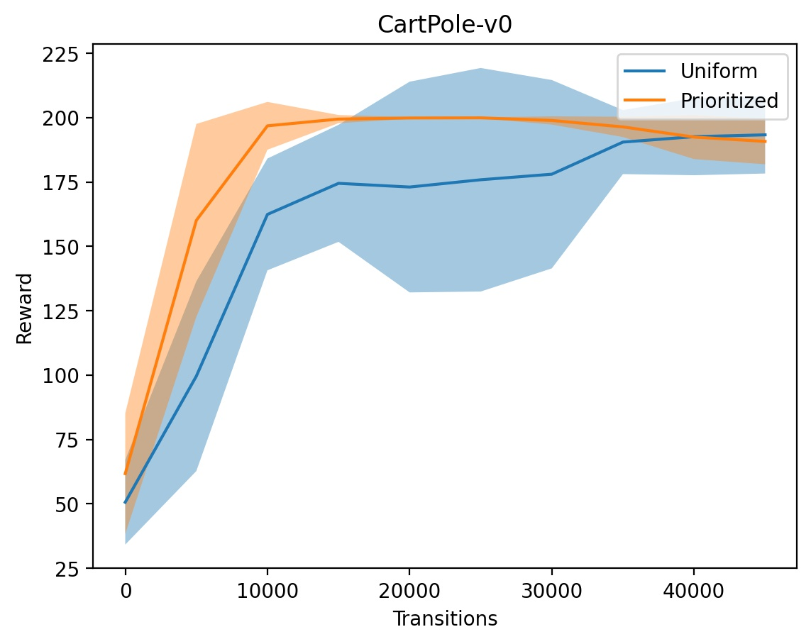
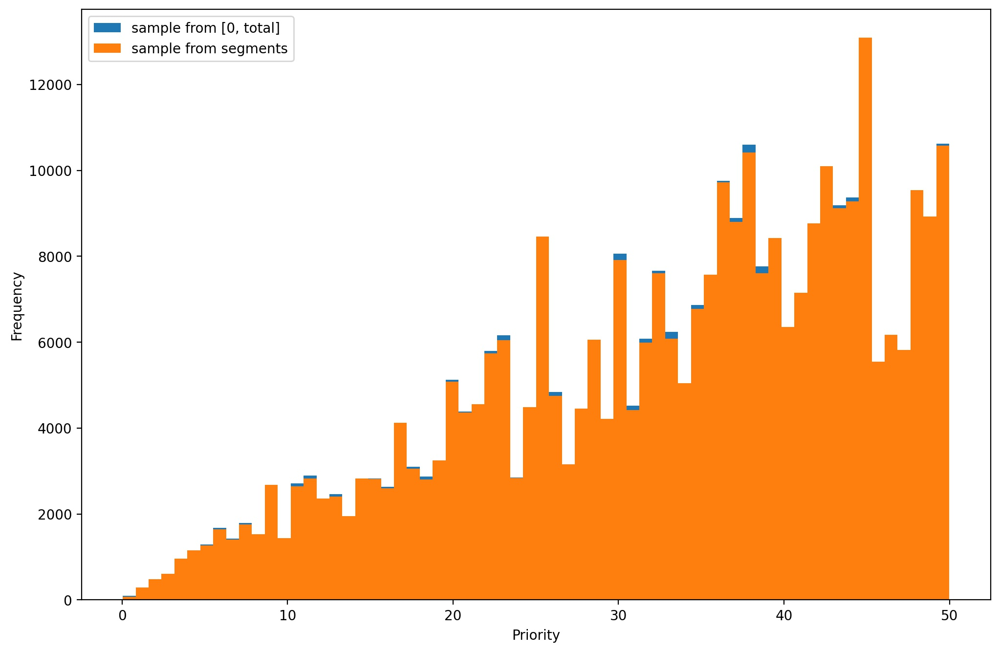

# Prioritized Experience Replay

Simple and straightforward implementation with comments.

`SumTree` unlike other python implementations, is implemented without recursion, which is nearly twice faster 
(based on a couple of tests in ipython).   
`train.py` also implements a simple DQN algorithm to validate PER.

## Results

### DQN with PER

10 seeds, not tuned hyperparameters, no beta schedule

<p float="left">
  
</p>

To reproduce, run
```bash
python train.py --seeds 10 CartPole-v0
```

### Sampling approaches

In the original publication, a particular method of prioritized sampling using SumTree is proposed, as follows: 

> To sample a minibatch of size k, the range [0, p_total] is divided equally into k ranges. Next, a value is uniformly 
> sampled from each range. Finally the transitions that correspond to each of these sampled values are retrieved from the tree.

However, there is no justification in the publication as to why this sampling method was proposed. Samples with higher 
priority correspond to a larger interval in [0, p_total], so it should be enough to sample k values from range 
[0, p_total] uniformly, which is simpler to code. 

As the graph below shows, there is no particular difference in the distribution of priorities among the two sampling methods. 



To reproduce, run 
```bash
python plots/sampling.py
```

# References

Schaul, T., Quan, J., Antonoglou, I., & Silver, D. (2016). Prioritized Experience Replay. ArXiv:1511.05952 [Cs]. http://arxiv.org/abs/1511.05952
